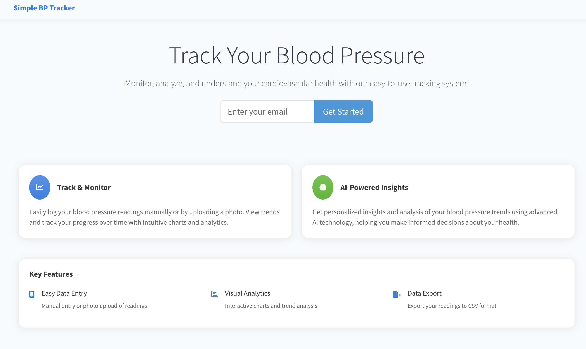
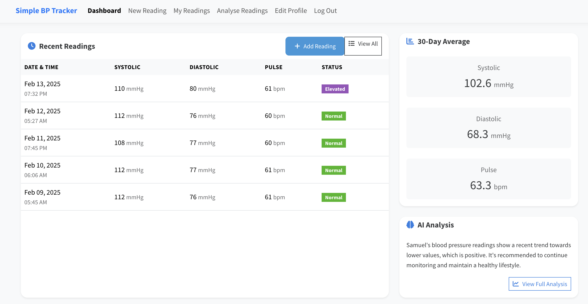
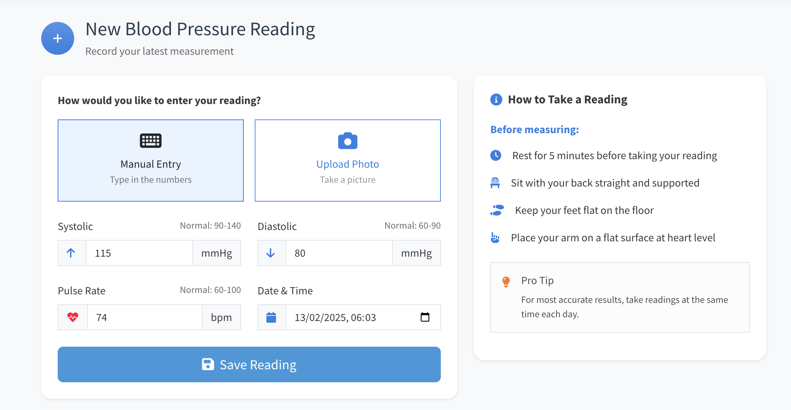
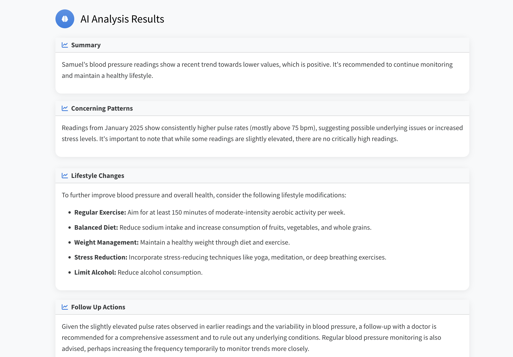

# Simple BP Tracker

A modern, user-friendly blood pressure tracking app built with Flask and Bootstrap 5, powered by Google Cloud services.



**Example of an AI-generated insight:**

"Based on your recent readings and activity patterns, we've noticed your blood pressure tends to be lower on days you exercise in the morning. This pattern suggests that morning exercise might be particularly beneficial for your cardiovascular health. Consider maintaining this routine and gradually increasing duration as your fitness improves."


## Features

- **Easy Data Entry**
  - Manual entry with validation
  - Photo upload of blood pressure monitor display
  - Quick input of systolic, diastolic, and pulse readings

- **AI-Powered Analysis**
  - Smart insights powered by Google's Gemini API
  - Natural language analysis of blood pressure trends
  - Personalized health recommendations
  - Automated pattern detection in readings
  - Context-aware health suggestions

- **Cloud Infrastructure**
  - Deployed on Google Cloud Run for scalability
  - Containerized application using Docker
  - Automatic scaling based on demand
  - High availability and reliability

- **User Management**
  - Passwordless authentication with magic links
  - Profile customization
  - Privacy-focused design

- **Data Visualization**
  - Interactive charts showing trends over time
  - Color-coded status indicators
  - Easy-to-read statistics

- **Export & Backup**
  - Export readings to CSV
  - Data backup capabilities
  - Print-friendly reports

## Cloud Architecture

This application leverages several Google Cloud services:

- **Google Cloud Run**
  - Serverless container execution
  - Automatic scaling from zero to many instances
  - Pay-per-use pricing model  == Cost-effective serverless architecture
  - HTTPS load balancing included

- **Google Gemini AI**
  - Advanced natural language processing for health insights
  - Pattern recognition in blood pressure data
  - Personalized health recommendations
  - Context-aware analysis of readings

Example of Gemini AI analysis:
```python
# The application uses Gemini to analyze blood pressure patterns
prompt = f"""
Analyze the following blood pressure readings and user profile:
{user_profile}
{readings_data}

Provide insights on:
1. Overall trends
2. Concerning patterns
3. Lifestyle recommendations
4. Follow-up actions
"""

response = model.generate_content(prompt)
analysis = json.loads(response.text)
```

## Getting Started

### Prerequisites

- Python 3.8 or higher
- pip (Python package installer)
- SQLite3

### Installation

1. Clone the repository:
```bash
git clone https://github.com/yourusername/simple-bp-tracker.git
cd simple-bp-tracker
```

2. Create and activate a virtual environment:
```bash
python -m venv venv
source venv/bin/activate  # On Windows: venv\Scripts\activate
```

3. Install dependencies:
```bash
pip install -r requirements.txt
```

4. Create a `.env` file in the project root with the following variables:
```env
APP_NAME=Simple BP Tracker
SECRET_KEY=your-secret-key
DATABASE_URI=sqlite:///bp_tracker.db
MAIL_SERVER=smtp.gmail.com
MAIL_PORT=587
MAIL_USERNAME=your-email@gmail.com
MAIL_PASSWORD=your-app-specific-password
MAIL_EMAIL=your-email@gmail.com
GEMINI_API_KEY=your-gemini-api-key
```

5. Initialize the database:
```bash
flask db upgrade
```

6. Run the application:
```bash
flask run
```

The application will be available at `http://localhost:5000`

## Usage

1. **Sign Up/Sign In**
   - Enter your email address
   - Click the magic link sent to your email
   - Complete your profile

2. **Record Readings**
   - Click "Add Reading" on the dashboard
   - Enter systolic, diastolic, and pulse values
   - Or upload a photo of your blood pressure monitor

3. **View Analysis**
   - Check the dashboard for recent readings
   - View AI-powered insights
   - Track trends over time

4. **Export Data**
   - Go to "My Readings"
   - Click "Export to CSV"
   - Download your data

## Technology Stack

- **Backend**: Flask (Python)
- **Frontend**: Bootstrap 5, JavaScript
- **Cloud Platform**: Google Cloud Run
- **AI/ML**: Google Gemini API
- **Database**: SQL
- **Authentication**: Magic Links (Passwordless)
- **Charts**: Chart.js
- **Icons**: Font Awesome

## Deployment

### Local Development
[Previous installation instructions remain the same...]

### Cloud Deployment

1. Build the Docker image:
```bash
docker build -t simple-bp-tracker .
```

2. Tag and push to Google Container Registry:
```bash
docker tag simple-bp-tracker gcr.io/[PROJECT-ID]/simple-bp-tracker
docker push gcr.io/[PROJECT-ID]/simple-bp-tracker
```

3. Deploy to Cloud Run:
```bash
gcloud run deploy simple-bp-tracker \
  --image gcr.io/[PROJECT-ID]/simple-bp-tracker \
  --platform managed \
  --allow-unauthenticated
```

## Security Features

- Passwordless authentication
- CSRF protection
- Input validation
- Secure session management
- Data encryption
- XSS prevention

## Contributing

1. Fork the repository
2. Create a feature branch (`git checkout -b feature/AmazingFeature`)
3. Commit your changes (`git commit -m 'Add some AmazingFeature'`)
4. Push to the branch (`git push origin feature/AmazingFeature`)
5. Open a Pull Request

## License

This project is licensed under the MIT License - see the [LICENSE](LICENSE) file for details.

## Acknowledgments

- [Flask](https://flask.palletsprojects.com/)
- [Bootstrap](https://getbootstrap.com/)
- [Google Gemini](https://deepmind.google/technologies/gemini/)
- [Chart.js](https://www.chartjs.org/)
- [Font Awesome](https://fontawesome.com/)

## Support

For support, email dftaiwo@gmail.com or open an issue in the GitHub repository.

## Roadmap

- [ ] Mobile app integration
- [ ] Multiple language support
- [ ] Blood pressure monitor device integration
- [ ] Health provider data sharing
- [ ] Advanced analytics dashboard

## Screenshots

### Dashboard


### New Reading


### Analysis


## Impact & Innovation

The idea behind this application is to demonstrate the transformative power of AI in healthcare:

- **Democratizing Health Insights**
  - Making complex medical data understandable for everyone
  - Providing hospital-grade analysis accessible from home
  - Breaking down barriers to preventive healthcare

- **Real-World Impact**
  - Users report better understanding of their health patterns
  - Preventive alerts helping catch concerning trends early
  - Making healthcare more proactive than reactive

- **Technical Innovation**
  - Effective use of Gemini API for medical data interpretation
  - Seamless integration of AI with traditional health metrics
  - Privacy-first architecture on Google Cloud
  - Scalable solution for global health monitoring

## How We Use Gemini AI

The application uses Google's Gemini AI in several ways:

1. **Intelligent Health Analysis**
   - Converts complex medical data into actionable insights
   - Provides personalized recommendations based on user patterns
   - Identifies subtle trends that might be missed by traditional analysis

2. **Health Insights + Natural Language Understanding**
   - Translates  blood pressure readings and medical jargon into plain language
   - Generates context-aware health explanations
   - Provides culturally sensitive health recommendations

3. **Predictive Healthcare**
   - Identifies potential health concerns before they become serious
   - Suggests preventive measures based on user patterns
   - Helps users make informed healthcare decisions
   - Suggests optimal measurement times

